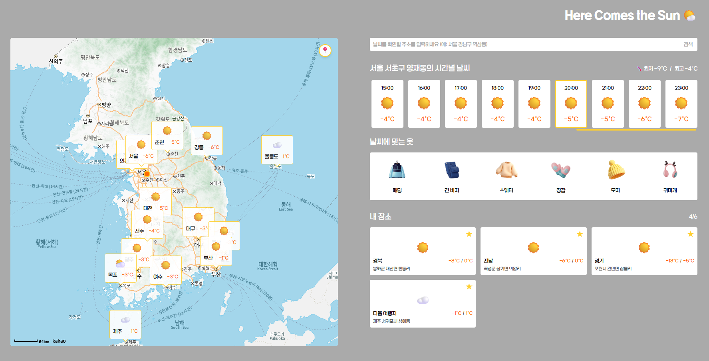
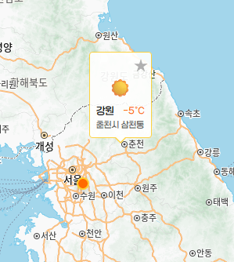
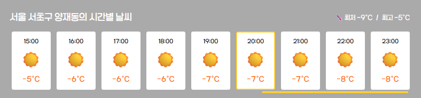
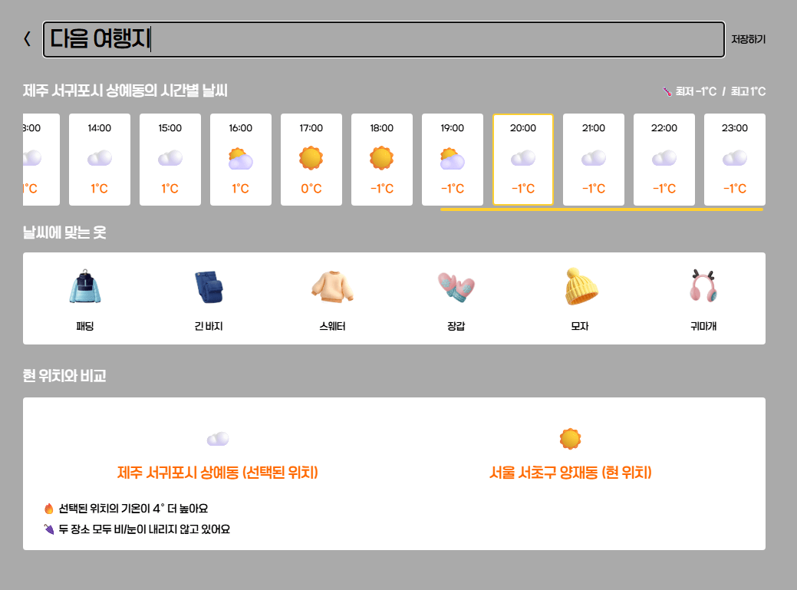
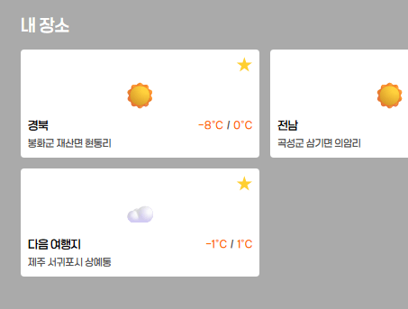
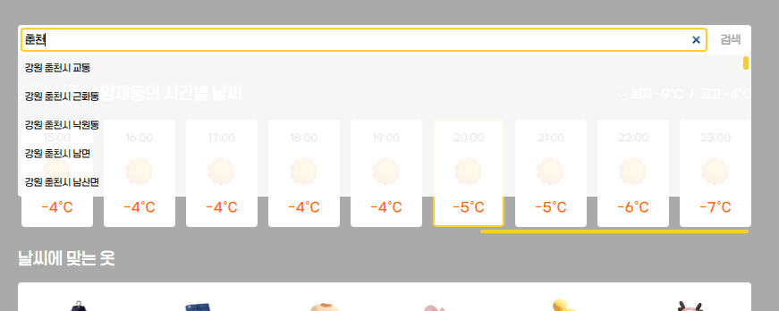
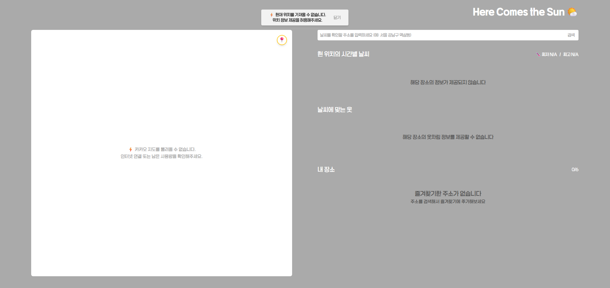
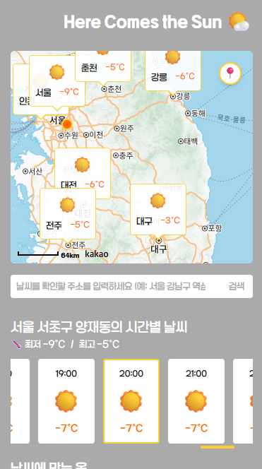

# 🌤️ Here Comes The Sun



내 위치/원하는 지역의 날씨를 지도 기반으로 빠르게 탐색하는 날씨 예보 웹사이트 입니다.

## 소개

Kakao Map 위에서 위치를 선택하면 해당 좌표의 날씨를 즉시 조회하고, 대시보드에서 시간대별 변화 + 옷차림 추천 + 지역간 비교까지 한 번에 확인할 수 있습니다.

유저가 지도를 보며 직관적으로 지역을 탐색하고, 다양한 지역을 즐겨찾기하고, 날씨 정보를 빠르게 확인할 수 있도록 만드는 것을 목표로 했습니다. 데이터 요청/캐싱은 TanStack Query로 관리하고, 위치/즐겨찾기 같은 전역 UI 상태는 Zustand로 관리합니다.

사용 스택:
Typescript, React, TanStack Query, Zustand, React Router Dom, Tailwind CSS, Kakao Map API, Open Meteo API

Kakao Map과 Open-Meteo는 모두 무료 플랜에서 사용 가능한 API로, 별도 인증/결제 과정 없이 빠르게 적용할 수 있어 소규모 프로젝트에 적합했습니다.
Open-Meteo는 해외 기반 데이터 특성상 국내 기상청과 비교했을 때 일부 지역에서 기온 오차가 발생할 수 있으나, 본 프로젝트의 목적에서는 체감 기능에 영향을 주지 않는 수준으로 판단했습니다.

## 실행

```js
npm install
npm run build
npm run preview
```

## 주요 기능

### 지도 기반 탐색


좀 더 친숙한 시각적 인터페이스로 지역을 탐색할 수 있도록 Kakao Map API를 연동했습니다. 유저는 지도에서 드래그/줌/클릭을 통해 자유롭게 위치를 선택하고, 선택한 지점의 날씨를 즉시 확인할 수 있습니다.

또한 마커 overlay 내부에서 다음과 같은 상호작용을 제공합니다.

- 마커 클릭 시 active 처리 (zIndex를 높여서 앞으로 가져오기)
- 선택 위치 마커에 대해 즐겨찾기 토글 버튼

아래 코드는 커스텀 overlay 내부 DOM 이벤트에서 data-action을 기반으로 즐겨찾기 토글과 일반 클릭을 분리 처리한 예시입니다.

```
content.addEventListener("click", (e: Event) => {
  e.stopPropagation();
  e.preventDefault();

  const target = e.target as HTMLElement;

  // 별 버튼이면 즐겨찾기 토글 이벤트 처리
  const btn = target.closest("[data-action='toggle-favorite']") as HTMLElement | null;

  if (btn) {
    this.onToggleFavorite?.(city);
    btn.classList.toggle("selected");
    return;
  }

  // 일반 클릭이면 active 처리
  this.setActive(city.id);
});

```



유저가 지도의 어느 위치를 클릭하면 해당 위치의 좌표를 저장하고, kakao geocoder를 거쳐 주소를 보강하는 코드입니다. 해당 좌표로 날씨 Query를 호출해 마커의 날씨 ui를 갱신합니다.

```
// 지도 클릭 이벤트 설정
        kakao.maps.event.addListener(
          map,
          "click",
          async (mouseEvent: kakao.maps.MouseEvent) => {
            const latlng = mouseEvent.latLng;
            const lng = latlng.getLng();
            const lat = latlng.getLat();

            const addressInfo = await coord2AddressAsync(
              geocoderRef.current!,
              lng,
              lat,
            );
            selectLocation(addressInfo);
          },
        );
```

좌표 ↔ 주소 변환은 Kakao Geocoder를 Promise 기반으로 래핑해서 사용했습니다.

```
// geocoder를 이용해 좌표를 주소로 변환하는 함수
export function coord2AddressAsync(
  geocoder: kakao.maps.services.Geocoder,
  lng: number,
  lat: number,
): Promise<GeocoderResult> {
  return new Promise((resolve) => {
    geocoder.coord2Address(lng, lat, (result, status) => {
      if (status !== kakao.maps.services.Status.OK || !result?.length) {
        // 주소를 찾지 못하면 기본값 반환
        resolve({ lat, lng, sido: "" });
        return;
      }

      const address = result[0].address as KakaoRegionAddress;
      resolve({
        lat,
        lng,
        sido: address.region_1depth_name,
        sigungu: address.region_2depth_name,
        dong: address.region_3depth_name,
      });
    });
  });
}
```

이 흐름을 통해 유저는 클릭한 지점의 행정구역 이름이 포함된 날씨 마커를 즉시 확인할 수 있습니다.

### 시간대별 날씨



기본 화면에서는 유저의 현재 위치 날씨를 기준으로 시간대별 기온/강수 정보를 표시합니다.
날씨 데이터는 무료 API인 Open-Meteo를 사용하며, 현재/시간대별/일간 데이터를 함께 수신합니다.

```
export type OpenMeteoForecastResponse = {
  latitude: number;
  longitude: number;
  timezone: string;

  current?: {
    time: string;
    interval: number;
    temperature_2m: number;
    weather_code: number;
    precipitation: number;
    snowfall: number;
  };

  hourly?: {
    time: string[];
    temperature_2m?: number[];
    weather_code?: number[];
    precipitation?: number[];
    snowfall?: number[];
  };

  daily?: {
    time: string[];
    temperature_2m_min?: number[];
    temperature_2m_max?: number[];
    precipitation_probability_max?: number[];
    precipitation_hours?: number[];
    precipitation_sum?: number[];
    snowfall_sum?: number[];
  };
};
```

일정상 현재는 당일 데이터만 파싱해서 사용하고 있지만, 함께 반환된 데이터를 활용해 추후 과거/미래 예보 확장도 손쉽게 적용할 수 있습니다.

요청을 보낸 시간을 기준으로 해당하는 데이터를 파싱해서 사용합니다.

```
export function parseHourlyByDate(
  hourly: OpenMeteoHourly,
  date: string, // "YYYY-MM-DD"
): HourlyPoint[] {
  const { start, end } = getHourlyRangeByDate(hourly, date);
  if (start < 0 || end <= start) return [];

  const result: HourlyPoint[] = new Array(end - start);
  for (let i = start, j = 0; i < end; i++, j++) {
    const t = hourly.time[i];
    result[j] = {
      time: t,
      hour: Number(t.slice(11, 13)),
      temperature: hourly.temperature_2m?.[i] ?? null,
      weatherCode: hourly.weather_code?.[i] ?? null,
      precipitation: hourly.precipitation?.[i] ?? null,
      snowfall: hourly.snowfall?.[i] ?? null,
    };
  }
  return result;
}
```

비슷한 방식으로 하루 최고/최저 기온도 반환할 수 있습니다. 반환한 데이터는 정보를 표기하고, 코드로 된 현재 날씨는 숫자 코드 기반의 날씨를 그대로 보여주기보다, 이모지로 변환해 시각적 정보를 더했습니다.

```
export function convertWeatherCodeToEmoji(code: number | null): WeatherEmoji {
  if (code === null) return "❔";

  if (code === 0) return "☀️"; // 맑음
  if (code === 1) return "⛅"; // 구름 조금
  if (code === 2 || code === 3) return "☁️"; // 구름 많음/흐림
  if (code === 45 || code === 48) return "☁️"; // 안개

  if ((code >= 71 && code <= 77) || code === 85 || code === 86) return "☃️"; // 눈
  if ((code >= 51 && code <= 67) || (code >= 80 && code <= 82)) return "☔"; // 비/소나기
  if (code >= 95 && code <= 99) return "⛈️"; // 뇌우

  return "☁️";
}
```

디폴트는 현재 위치의 날씨를 노출하지만, 날씨 섹션은 mode 값으로 “현재 위치 / 선택 위치”를 분리하여 재사용이 가능합니다.

```
export function WeatherSection({ mode = "current" }: WeatherSectionProps) {
  // 현재 위치의 날씨 데이터
  const currentLocation = useCurrentLocationStore((s) => s.currentLocation);
  const selectedLocation = useSelectLocationStore((s) => s.selectedLocation);

  // mode에 따라 사용할 location 결정
  const location = mode === "selected" ? selectedLocation : currentLocation;
```

### 옷차림 추천

당일 최저/최고 기온에 맞는 옷차림을 추천합니다. 기준은 별도의 상수로 정의해 UI/로직을 분리했습니다.

```
// 최고 기온 기준
export const CLOTHING_ADVICE: Record<number, CLOTHING_OPTIONS[]> = {
  "-1": ["paddedjacket", "pants", "sweater", "gloves", "hat", "earmuff"], // ~-1도
  4: ["paddedjacket", "sweater", "pants", "gloves"],
  8: ["heavyjacket", "sweater", "pants"],
  11: ["coat", "hoodie", "jacket", "pants"],
  16: ["cardigan", "hoodie", "pants", "jacket"],
  22: ["shirt", "pants"],
  27: ["skirt", "tshirt", "shorts", "dress"],
  999: ["tshirt", "skirt", "shorts", "slippers", "sunglasses"], // 27도~
};


export function getClothingAdvice(
  min: number,
  max: number,
): { options: CLOTHING_OPTIONS[]; hasTempDiff: boolean } {
  const minKey = TEMP_KEYS.find((t) => min <= t) ?? 999;
  const maxKey = TEMP_KEYS.find((t) => max <= t) ?? 999;

  const key =
    minKey === maxKey
      ? minKey
      : TEMP_KEYS[
          TEMP_KEYS.indexOf(minKey) +
            Math.floor(
              (TEMP_KEYS.indexOf(maxKey) - TEMP_KEYS.indexOf(minKey)) / 2,
            )
        ];
  return {
    options: CLOTHING_ADVICE[key as keyof typeof CLOTHING_ADVICE],
    hasTempDiff:
      Math.abs(TEMP_KEYS.indexOf(maxKey) - TEMP_KEYS.indexOf(minKey)) >= 2,
  };
}
```

최고와 최저 기온이 2단계 이상 차이 나는 경우 일교차가 큰 것으로 정의하고 hasTempDiff 값을 반환해 대시보드 내에서 일교차에 관한 안내를 합니다. 이런 경우 평균 값에 해당하는 기온에 맞춘 옷차림을 반환합니다.

추후 강수 예보가 있으면 관련 아이템을 추천하기 위해 별도로 추천 옷차림 상수를 작성해두었습니다. open meteo api는 대한민국 날씨에 대해서는 강수 확률을 반환하지 않기 때문에 강수량을 기반으로 판단하는 로직을 작성 중입니다.

```
export const SPECIAL_CLOTHING: Record<string, CLOTHING_OPTIONS[]> = {
  rain: ["rainboots", "umbrella"],
};
```

### 즐겨찾기


유저가 지도 위에서 선택한 지점은 디폴트 주요 도시 마커와 다르게 즐겨찾기을 제공합니다.
Kakao CustomOverlay는 생성 이후 DOM 구조 변경이 어렵기 때문에, 마커 생성 시점에 선택 마커 여부를 판단해 즐겨찾기 버튼를 노출합니다.

```
//마커 생성 및 오버레이 추가
  createOverlay(city: City, isFavorite?: boolean): kakao.maps.CustomOverlay {
    const htmlString = fillCityMarkerContent(city);
    const wrapper = document.createElement("div");
    wrapper.innerHTML = htmlString;
    const content = wrapper.firstElementChild as HTMLElement;

    if (city.id === "selected-location") {
      const favoriteButton = content.querySelector("#favorite-button");
      //선택된 위치 마커는 즐겨찾기 버튼을 노출
      if (favoriteButton) {
        favoriteButton.classList.remove("hidden");
        if (isFavorite) favoriteButton.classList.add("selected");
      }
    }

    ...
```

즐겨찾기 토글 이벤트는 OverlayManager에서 handler를 전달받아
지도 UI에서 발생한 이벤트가 React 상태(Zustand)와 자연스럽게 동기화되도록 했습니다.

```
// 즐겨찾기 토글 핸들러 설정
  setHandlers(handlers: { onToggleFavorite?: (city: City) => void }) {
    this.onToggleFavorite = handlers.onToggleFavorite
  }

```

favorite 스토어에 저장된 값은 즐겨찾기 섹션에서 바로 반영되서 분리해둔 즐겨찾기 카드 리스트에 바로 보여집니다.

```
const handleFavoriteClick = (e: React.PointerEvent<HTMLButtonElement>) => {
    e.preventDefault();
    e.stopPropagation(); //즐겨찾기 버튼 클릭시 카드 클릭 이벤트가 발생하는 것을 방지
    removeFavorite(city.id);
    clearLocation();
  };

```

카드의 즐겨찾기 버튼을 클릭하면 favorite 스토어에서 해당 값을 삭제하고 clearLocation으로 선택 장소를 초기화해서 선택 장소 마커도 삭제 트리거합니다.
이렇게 카카오 지도에 보이는 값과 대시보드의 즐겨찾기 리스트를 동기화해서 이질감 없이 양쪽에서 삭제, 추가가 가능하게 구현했습니다.

### 상세페이지



즐겨찾기에 추가된 지역은 클릭해서 상세 페이지로 이동할 수 있습니다. 현재는 즐겨찾기 기반으로만 접근 가능하지만, 추후 일반 지역도 접근 가능하도록 확장할 계획입니다.

따라서 바로 캐싱된 데이터 없이 바로 상세페이지로 접근한 경우에도 정보를 표시할 수 있게 라우팅시 필요한 데이터를 query params로 전달합니다.

```
const handleCardClick = () => {
    selectLocation(city);

    navigate({
      pathname: routes.info,
      search: createSearchParams({
        lat: String(city.lat),
        lng: String(city.lng),
        sido: city.sido,
        sigungu: city.sigungu ?? "",
        dong: city.dong ?? "",
      }).toString(),
    });
  };

```

상세 페이지에서는 param을 파싱해 location을 재구성하고, 좌표 형식이 올바르지 않은 경우 예외 처리합니다.

```
const [sp] = useSearchParams();

  const lat = Number(sp.get("lat"));
  const lng = Number(sp.get("lng"));
  const sido = sp.get("sido") ?? "";
  const sigungu = sp.get("sigungu") ?? "";
  const dong = sp.get("dong") ?? "";

  const location = useMemo(
    () => ({ lat, lng, sido, sigungu, dong }),
    [lat, lng, sido, sigungu, dong],
  );

```

상세 페이지에서는 WeatherSection을 선택 위치 모드로 호출하고,
별명 수정 기능을 통해 즐겨찾기 정보를 업데이트합니다.

```
updateNickname: (cityId, nickname) => {
        set((state) => ({
          favorites: state.favorites.map((c) =>
            c.id === cityId ? { ...c, nickname } : c,
          ),
        }));
      },

```



추가된 해당 장소의 별명은 다시 메인 페이지로 돌아왔을 때 즐겨찾기 리스트에서 갱신된 것을 확인할 수 있습니다.

또한, 유저의 현재 위치의 날씨 정보와 선택된 위치의 날씨 정보를 비교합니다. 아래는 비교하는 범위의 예시입니다.

```
export type CompareCurrentWeatherResult = {
  tmpDiff: number; // selected - current (current 기준 차이)
  currentCode: number;
  selectedCode: number;
  hasShowerDiff: boolean; //둘 중 한 곳이라도 눈/비(강수)가 오면
  isShowerCurrent: boolean; //눈/비 내리는 쪽이 current면
};
```

선택된 지역으로 여행을 간다는 가정하에, 새로운 날씨에 준비해야할 것이 있는지 빠르게 확인할 수 있습니다.

### 주소 검색과 리스트 제공

korea_districts.json을 파싱해서 추천 주소 리스트에 사용합니다. 단순 유저 인풋을 문자열 검색하는 것보다 편리한 검색 기능을 제공하기 위해 먼저 json파일을 인덱싱 해서 빠른 검색이 가능하도록 했습니다.

```
export function buildDistrictsIndex(lines: string[]): DistrictIndex {
  const sigunguBySido = new Map<string, Set<string>>();
  const dongBySidoSigungu = new Map<string, Set<string>>();
  const sigunguToSidos = new Map<string, Set<string>>();
  const dongToSidoSigunguKeys = new Map<string, Set<string>>();

  for (const raw of lines) {
    const line = (raw ?? "").trim();
    if (!line) continue;

    const parts = line
      .split("-")
      .map((p) => p.trim())
      .filter(Boolean);
    const [sido, sigungu, dong] = parts;

    if (!sido) continue;

    // sido 등록
    if (!sigunguBySido.has(sido)) sigunguBySido.set(sido, new Set());

    // sigungu 등록
    if (sigungu) {
      sigunguBySido.get(sido)!.add(sigungu); // sido -> sigungu

      if (!sigunguToSidos.has(sigungu)) sigunguToSidos.set(sigungu, new Set());
      sigunguToSidos.get(sigungu)!.add(sido); // sigungu -> sido

      // dong 등록
      if (dong) {
        const key = `${sido}+${sigungu}`;
        if (!dongBySidoSigungu.has(key)) dongBySidoSigungu.set(key, new Set());
        dongBySidoSigungu.get(key)!.add(dong); // "sido+sigungu" -> dong

        if (!dongToSidoSigunguKeys.has(dong))
          dongToSidoSigunguKeys.set(dong, new Set());
        dongToSidoSigunguKeys.get(dong)!.add(key); // dong -> "sido+sigungu"
      }
    }
  }
```

4가지 경우를 고려해서 key를 생성했습니다.

- 시/도만 입력한 경우 -> 해당하는 시/도에 속한 시/군/구 + 동을 추천 (예시: 서울 -> 서울의 모든 구)
- 시/도 + 시/군/구가 입력된 경우 -> 해당 지역에 속한 동을 추천 (예시: 서울 서초구 -> 서초구의 모든 동)
- 시/군/구만 입력한 경우 -> 해당 시/군/구를 가진 시/도를 추천 (예시: 중구 -> 서울 중구, 부산 중구, 대구 중구 등)
- 동만 입력한 경우 -> 해당 동을 가진 시/도 + 시/군/구를 추천 (예시: 봉천동 -> 봉천동이라는 동을 가진 모든 시/도 시/군/구 전체 경로)

실제로 테스트해봤을 때 바로 서울 -> 서초구 -> 양재동 순서로 입력하는 것보다 바로 "구"나 "동"을 바로 검색하는 것이 압도적으로 편하게 느껴졌습니다. 따라서 전체 문자열로 통으로 검색하는 것보다 단계별 로직을 추가해서 상황에 맞는 서칭이 편리하고 빠르다고 판단했습니다.

인덱싱한 키에 맞춰서 상황에 맞는 주소 후보군을 추천해서 검색바 아래에 리스트를 제공했습니다.

```
export function suggestAddress(
  query: string,
  index: DistrictIndex,
): SuggestAddress[] {
  const tokens = normalizeQuery(query);
  if (tokens.length === 0) return [];

  // 키 배열은 입력 1회당 1번만 생성 (불필요 반복 제거)
  const sigunguKeys = Array.from(index.sigunguToSidos.keys());
  const dongKeys = Array.from(index.dongToSidoSigunguKeys.keys());

  // -------------------------
  // 1) 단일 토큰: 시도 > 시군구 > 동
  // -------------------------
  if (tokens.length === 1) {
    const q = tokens[0];

    // 1-1) 시도 EXACT면: 해당 시도의 시군구 전체
    const exactSido = findExactSido(q, index.sidos);
    if (exactSido) {
      const sigungus = index.sigunguBySido.get(exactSido) ?? [];
      return uniqueByLabel(
        sigungus.map((sigungu) => ({
          level: "sigungu",
          label: joinLabel([simplifySido(exactSido), sigungu]),
          sido: exactSido,
          sigungu,
        })),
      );
    }

    // 1-2) 시도 후보가 있으면: 시도 후보만
    const sidoCandidates = matchSidoAll(q, index.sidos);
    if (sidoCandidates.length > 0) {
      return uniqueByLabel(
        sidoCandidates.map((sido) => ({
          level: "sido",
          label: simplifySido(sido),
          sido,
        })),
      );
    }

...
```

또한, 지역 json 파일은 축약버전이 아닌 정식 행정명으로 되어있기 때문에 (서울 대신 서울특별시, 세종시 대신 세종특별자치시), 더 용이한 검색을 위해 유저가 입력한 지역이 축약버전과 동일한지, 전체 명칭과 동일한지 등 다방면으로 검증합니다.

```
function findExactSido(token: string, sidos: string[]): string | null {
  const t = token.trim();
  if (!t) return null;
  return sidos.find((s) => s === t || simplifySido(s) === t) ?? null;
}

//긴 시도 명을 축약된 명으로 변환 (예: "서울특별시" -> "서울")
export function simplifySido(region: string): string {
  return REGION_MAP[region] ?? region;
}
```

축약된 시/도 명칭을 반환하는 함수를 생성해서 공통으로 사용합니다.

```
const handleSubmit = (e: React.FormEvent) => {
    e.preventDefault();

    if (!input.trim()) return;
    tmpSelectLocation(input.trim()); // 입력한 주소를 임시 선택 장소로 설정
    setSearchInProgress(true); // 검색 중 상태로 설정
    setIsFocused(false);
    setInput("");
  };
```



유저가 추천된 주소 리스트에서 주소를 고르거나, 직접 입력한 후 검색을 누르면 임시로 해당 주소를 tmpSelectLocation에 저장합니다. 임시로 저장된 해당 주소 string으로 다시 kakao map geocoder를 사용해 역으로 좌표를 받아와서 임시 저장은 지우고 정식 selectedplace로 저장합니다.

```
useEffect(() => {
    if (!tmpSelectedLocation) {
      setSearchInProgress(false);
      return;
    }

    if (!geocoderRef.current) {
      setSearchInProgress(false);
      clearLocation();
      show("지도를 불러오는 중입니다. 잠시 후 다시 시도해주세요.");
      return;
    }

    const geocoder = geocoderRef.current;

    //임시 주소의 좌표를 검색해서 선택된 장소로 확정
    addressToCoordAsync(geocoder, tmpSelectedLocation)
      .then((location) => {
        clearLocation();

        console.log("Address converted to coordinates:", location);
        selectLocation(location);
        setSearchInProgress(false);
      })
      .catch((error) => {
        console.error("주소를 좌표로 변환하는 중 오류 발생:", error);
        show(
          "입력한 주소의 위치를 찾을 수 없습니다. 주소를 다시 확인해주세요.",
        );
        setSearchInProgress(false);
      });
  }, [tmpSelectedLocation]);
```

이제 유저가 직접 지도에서 해당 위치를 선택한 것과 동일한 로직으로 계산된 좌표에 선택 마커를 추가하고 날씨 정보를 업데이트합니다.

### 상태 관리와 캐싱

지도에서 자유롭게 위치를 클릭하면서 날씨를 탐색할 수 있는 기능과, 무료 API의 요청 제한 때문에 사용량 관리가 중요했습니다. 따라서 TanStack Query로 서버에서 페칭한 데이터를 관리하고, Zustand 스토어로 ui 관련 전역 상태를 관리합니다.

아래는 날씨 정보를 가져오는데 사용한 날씨 query입니다.

```
export const weatherQueries = {
  // 좌표 기반 전체 날씨 데이터 쿼리
  byLatLng: (p: WeatherFetchParams) =>
    queryOptions({
      queryKey: weatherKeys.byLatLng(p.lat, p.lng),
      queryFn: ({ signal }) => fetchWeatherByLatLng(p, signal),
      staleTime: WEATHER_STALE_TIME,
      gcTime: WEATHER_CACHE_TIME,
      enabled: Number.isFinite(p.lat) && Number.isFinite(p.lng),
    }),

  // 현재 날씨 온도와 코드만 추출하는 쿼리
  nowByLatLng: (p: WeatherFetchParams) =>
    queryOptions({
      queryKey: weatherKeys.nowByLatLng(p.lat, p.lng),
      queryFn: ({ signal }) => fetchWeatherByLatLng(p, signal),
      select: (res) =>
        ({
          temp: res.current?.temperature_2m ?? null,
          code: res.current?.weather_code ?? null,
        } satisfies { temp: number | null; code: number | null }),
      staleTime: WEATHER_STALE_TIME,
      gcTime: WEATHER_CACHE_TIME,
      enabled: Number.isFinite(p.lat) && Number.isFinite(p.lng),
    }),
};
```

날씨가 건물 단위로 바뀌는 것은 아니기 때문에 아주 상세한 좌표로 요청을 보내는 것은 비효율적이라 판단했습니다. 요청을 보내기 전에 100m 정도의 단위인 3자리 수로 반올림해서 날씨 정보를 요청합니다.

nowByLatLng 쿼리는 select로 필요한 필드를 추출해서 마커 생성에 필요한 정보만 사용합니다.

전역 상태와 ui 반응성에 영향을 주는 상태는 zustand에서 관리합니다. 아래는 localstorage를 활용한 persist한 즐겨찾기 스토어입니다.

```
export const useFavoriteCityStore = create<FavoriteCityStore>()(
  persist(
    (set, get) => ({
      favorites: [],

      isFavorite: (cityId) => get().favorites.some((c) => c.id === cityId),

      addFavorite: (city) => {
        const id = makeUniqueCityId(city); //주소 기반으로 고유 ID 생성
        const nextCity: Favorite = { ...city, id, nickname: "" };

        set((state) => {
          // 중복 방지: 이미 있으면 맨 앞으로 끌어올리기
          const without = state.favorites.filter((c) => c.id !== id);
          const next = [...without, nextCity].slice(-MAX_FAVORITES);
          return { favorites: next };
        });
      },

      removeFavorite: (cityId) => {
        set((state) => ({
          favorites: state.favorites.filter((c) => c.id !== cityId),
        }));
      },

...
```

그 외에도 유저가 선택한 위치, 유저의 현재 위치 등에 대한 정보도 스토어에서 관리하고 있습니다.

### 기타 사용성 개선

**_스켈레톤과 안내 메세지_**



```
{isError && !isLoading && (
            <div className="h-30 flex flex-col justify-center items-center text-secondary text-sm w-full text-center">
              <span>날씨 정보를 불러올 수 없습니다 </span>
              <span className="text-s">잠시 후 다시 시도해주세요</span>
            </div>
          )}

...

<span
        id="weather-emoji"
        className={`text-lg h-10 min-w-10 flex items-center justify-center rounded-sm ${isLoading ? "bg-background animate-[pulse_1.6s_ease-in-out_infinite] transition-colors duration-300" : ""}`}
        aria-hidden="true"
      >
        {weatherData?.current &&
          convertWeatherCodeToEmoji(weatherData.current.weather_code)}
      </span>

...
```

로딩 중인 상태를 알 수 있게 전체적으로 스켈레톤 ui를 적용해서 정보가 자연스럽게 추가될 수 있게 했습니다. query 상태의 isLoading과 isError을 적절히 사용해 관련 안내 문구를 노출합니다.

**_공용 토스트 모달_**

```
import { useToastStore } from "@/shared/model/toastStore";

export function Toast() {
  const { message, hide } = useToastStore();

  if (!message) return null;

  return (
    <aside className="fixed inset-0 px-6 py-8 pointer-events-none w-full flex justify-center z-50">
      <article
        role="alert"
        aria-live="polite"
        className="rounded-sm bg-white text-black text-center text-xs px-6 py-2 shadow-md flex flex-row items-center pointer-events-auto opacity-85 w-fit h-fit"
      >
        <p className="whitespace-pre-wrap">{"⚡ " + message}</p>
        <button
          className="ml-6 text-background cursor-pointer whitespace-nowrap"
          onClick={hide}
          aria-label="알림 닫기"
        >
          닫기
        </button>
      </article>
    </aside>
  );
}

...

export default function App() {
  return (
    <>
      <Toast />
      <AppRouter />
    </>
  );
}

```

공용으로 사용되는 Toast 모달과 관련 store를 만들어서 중요 안내 문구를 toast 모달로 노출합니다.

**_반응형 디자인_**



```
@theme {
  /* min width 기준 breakpoints */
  --breakpoint-*: initial;
  --breakpoint-xs: 0px;
  --breakpoint-sm: 429px;
  --breakpoint-md: 639px;
  --breakpoint-lg: 1023px;
...

```

기기별 breakpoint를 추가해서 너비에 맞는 반응형 레이아웃을 제공합니다. md 이상은 두 줄, 그 이하는 한 줄 등 상황에 맞춘 스타일을 제공합니다.

### 회고

아래는 추후 추가할 계획 중인 기능 리스트입니다.

- 목적지와 도착지를 선택해서 날씨 비교 & 지도에 거리 표시
- 강수 가능성 계산
- 강수 여부에 따라 옷차림 추천에 특정 아이템 추가
- 미래 / 과거 날짜의 날씨 조회 기능

React 트리 바깥에서 dom이 생성되는 카카오맵과 대시보드에서 일관적인 데이터를 보여주기 위해 상태 관리와 동기화가 중요한 프로젝트였습니다. 또한 처음으로 FSD 아키텍처를 적용하며 기능 단위로 책임을 분리하는 과정에서 코드 구조화와 확장성에 대한 이해를 넓힐 수 있었습니다.
